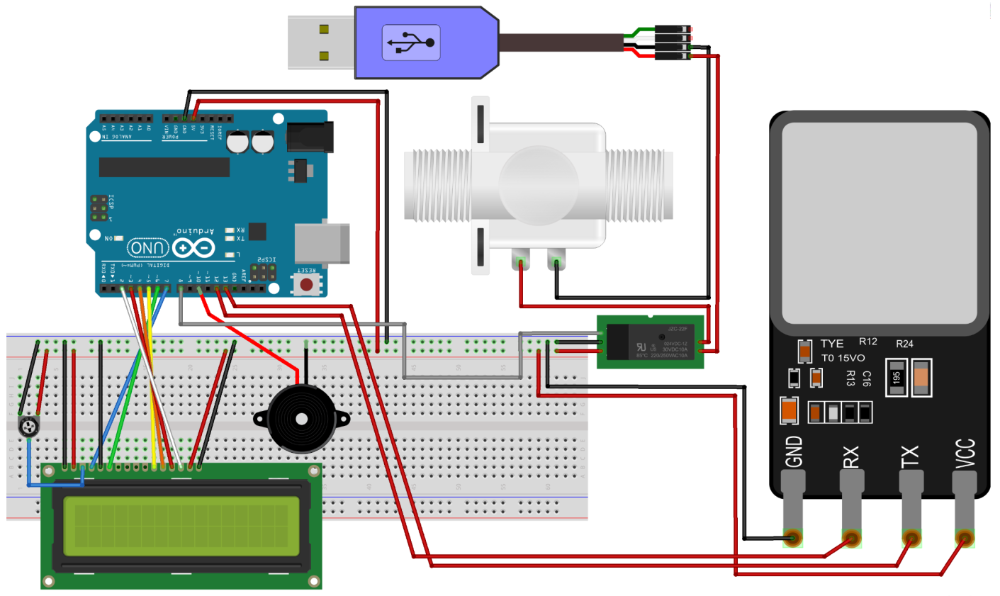
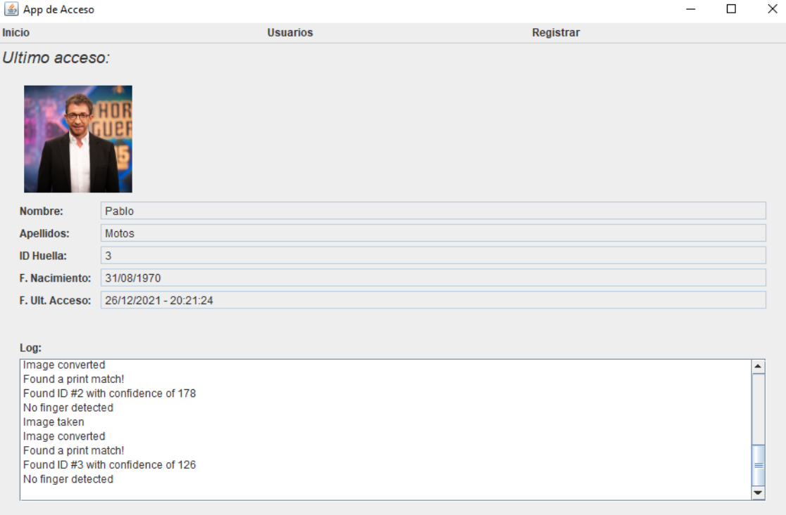
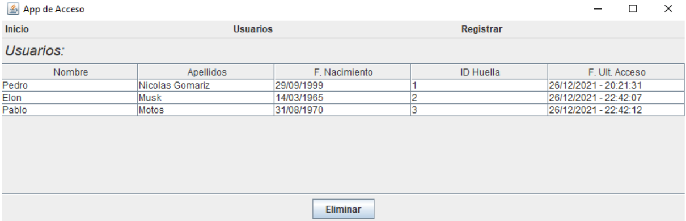
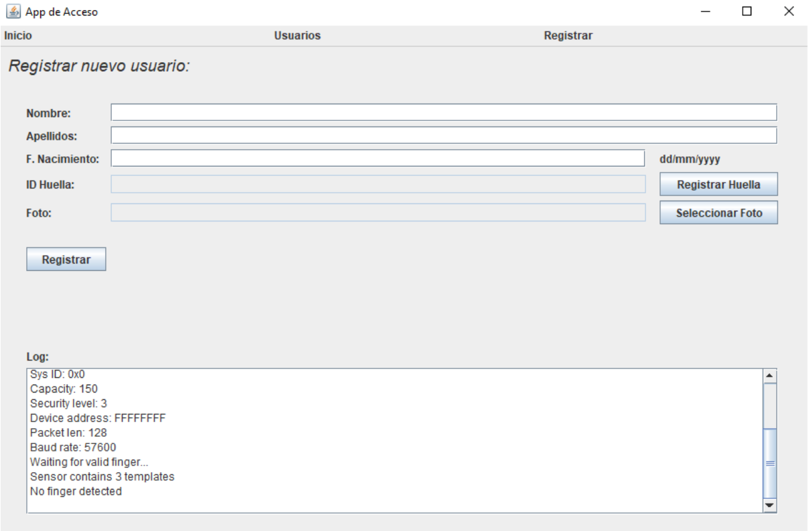
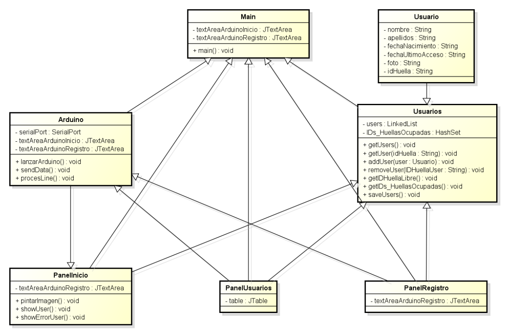
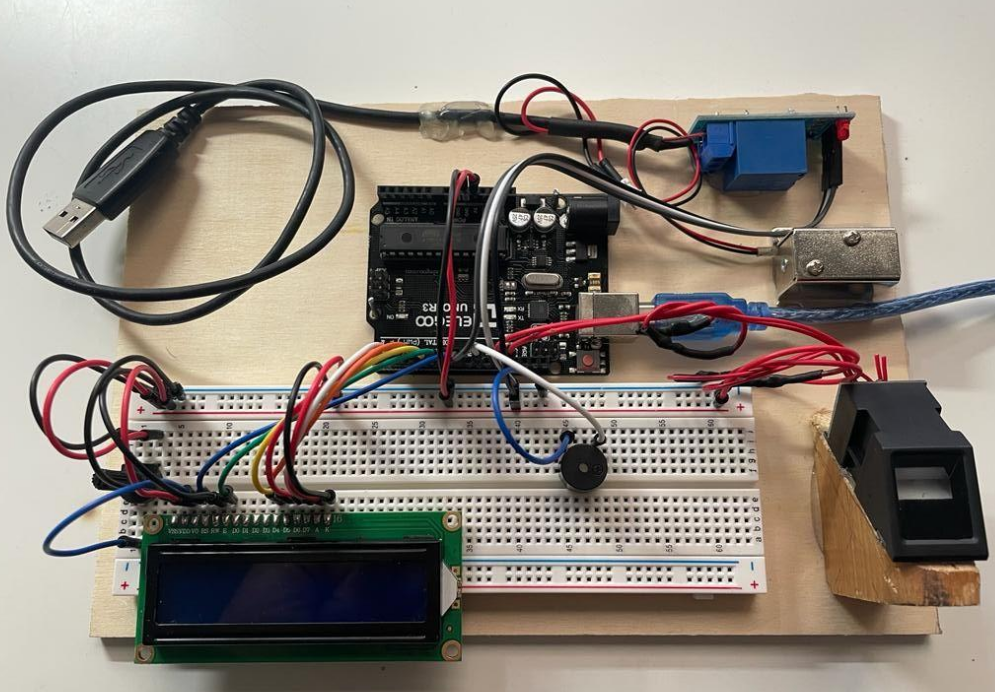

# FingerprintAccessSystem

Aplicación de escritorio y sistema embebido desarrollados como parte de la asignatura **Programación de Sistemas Embebidos en Red (PSER)** (Universidad de Murcia, curso 2021/2022).

- [📄 Documentación completa.](./doc/Memoria_PSER.pdf)

## 1. 📌 Descripción del Proyecto

Este sistema de control de acceso autentica usuarios mediante huella dactilar, gestiona la apertura de una cerradura electrónica y registra los accesos. El sensor de huellas está conectado a Arduino, que se comunica con una aplicación Java para la administración y visualización a través de una interfaz gráfica.

Casos de uso habituales:

- Empresas
- Gimnasios
- Salas de estudio privadas

### Tecnologías utilizadas

## 2. 🔩 Materiales

- **Arduino UNO**
- **Sensor de huella dactilar**
- **Pantalla LCD 2x16**
- **Buzzer activo (zumbador)**
- **Módulo relé 5V**
- **Electrocerradura 5V**
- **Fuente de alimentación externa (5V)**
- **Conexión USB para comunicación serie con PC**

## 3. ⚙️ Arduino

Arduino es el núcleo embebido del sistema. Se encarga de:

- Leer y verificar huellas dactilares.
- Controlar el relé que abre la cerradura.
- Mostrar mensajes en el LCD.
- Emitir señales acústicas con el buzzer.

### 3.1. 🧩 Esquemático

Se ha desarrollado un esquema de conexión en el que el sensor, buzzer, relé, y pantalla LCD están conectados a los pines digitales de Arduino. El relé permite usar una fuente externa para la cerradura, ya que Arduino no puede proporcionar suficiente intensidad.

### 3.2. 🔐 Sensor Fingerprint y Librería Adafruit

Se ha utilizado la librería [Adafruit-Fingerprint](https://github.com/adafruit/Adafruit-Fingerprint-Sensor-Library), la cual simplifica:

- Registro de huellas (`enroll.ino`)
- Verificación de huellas (`fingerprint.ino`)
- Eliminación de huellas (`delete.ino`)

El sensor:

- Utiliza imagen óptica para capturar huellas.
- Almacena hasta 127 registros.
- Posee DSP interno para identificación rápida.

### 3.3. 🧠 Funcionamiento General del `.ino`

El programa `.ino` integra los tres modos de funcionamiento:

- **Modo Verificación:** Detecta huellas existentes.
- **Modo Registro (1 por serie):** Registra nuevas huellas.
- **Modo Eliminación (2 por serie):** Borra huellas por ID.

Arduino recibe comandos por puerto serie para cambiar entre modos, y responde con mensajes que interpreta la UI en Java.

## 4. 🖥️ Interfaz Gráfica en Java

La aplicación de escritorio está desarrollada con Swing y permite:

- Visualizar registros de acceso.
- Registrar y eliminar usuarios.
- Controlar el sensor de huellas mediante el puerto serie.
- Mostrar mensajes y estados en tiempo real.

La interfaz se organiza en tres paneles principales:

- **Inicio:** Muestra los logs y el último acceso realizado.

- **Usuarios:** Presenta la lista de usuarios y permite su eliminación.

- **Registrar:** Facilita el alta de nuevos usuarios, la captura de huella y foto.

### 4.1. 📐 Diagrama de Clases del Programa

- `Main`: Punto de entrada. Carga UI y establece conexión con Arduino.
- `PanelInicio`: Visualización del acceso más reciente.
- `PanelUsuarios`: Listado de usuarios y botón de eliminación.
- `PanelRegistro`: Formulario para alta de usuario.
- `Usuario`: Clase POJO (Plain Old Java Object) con datos del usuario.
- `Usuarios`: Gestión y persistencia de usuarios.
- `Arduino`: Comunicación serie con la placa.

### 4.2. 🗃️ Persistencia de Usuarios

La clase `Usuarios` gestiona un fichero plano `users.txt`, donde:

- Cada línea representa un usuario en formato JSON.
- Al iniciar, se carga el archivo y se crea la lista en memoria.
- Al cerrar, se guarda el estado actual.

Este enfoque es simple pero funcional para una demo.

## 5. 🔄 Comunicación Serie Arduino–Java

La clase `Arduino` en Java gestiona la conexión USB usando la librería [jSerialComm](https://fazecast.github.io/jSerialComm/):

### Funciones principales:

- **`lanzarArduino()`**: Establece la conexión y lanza un hilo para leer datos del puerto.
- **`processLine()`**: Procesa cada línea recibida del Arduino.
  - `Found ID`: huella válida → muestra usuario.
  - `Did not find a match`: acceso denegado.
- **`sendData(String comando)`**: Envía comandos al Arduino para cambiar de modo o gestionar huellas.

Este sistema permite controlar completamente la lógica de Arduino desde la aplicación Java.

## 6. 🎬 Demo

A continuación se muestra una imagen representativa del proyecto y un vídeo demostrativo del funcionamiento del sistema:

📽️ **[Haz clic aquí para ver el video demo](./doc/demo/demo.mp4)**  
_(Formato: MP4, se abrirá o descargará según tu navegador)_

## 👨‍💻 Autor

- Pedro Nicolás Gomariz — [pedro.nicolasg@um.es](mailto:pedro.nicolasg@um.es)

Proyecto desarrollado como entrega final de la asignatura **Programación de Sistemas Embebidos en Red (PSER)** - Universidad de Murcia (curso 2021/2022).

Todos los derechos reservados © 2022.

El contenido de este repositorio, salvo que se indique lo contrario, está protegido por la legislación vigente sobre propiedad intelectual. El uso, reproducción o distribución total o parcial del material requiere el consentimiento expreso de los autores.
